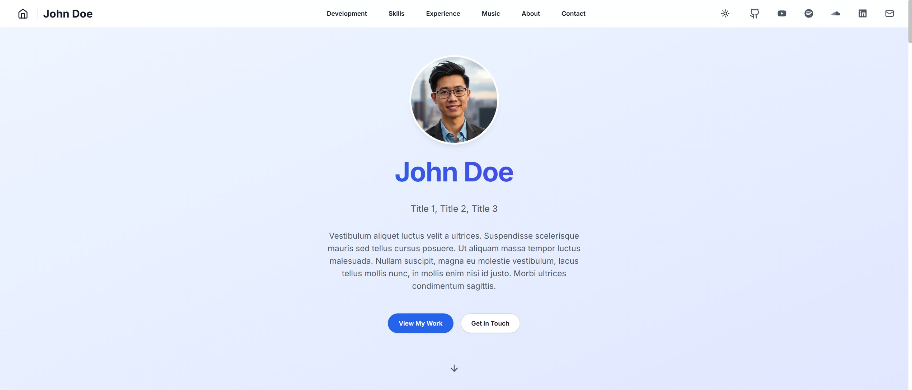

# Personal Portfolio Website Template

A modern, responsive portfolio website template built with Next.js 14, TypeScript, and Tailwind CSS. Features dark mode, smooth animations, and interactive components. Designed to be fully customizable to showcase your unique skills and projects. Optimized for SendGrid and Vercel for deployment, but can be adapted for other service providers. 



## Features

- 🌓 Dark/Light mode with system preference detection
- 🎨 Smooth animations and transitions
- 📱 Fully responsive design
- 🎵 Optional integrations (Spotify, SoundCloud, etc.)
- 📧 Contact form with SendGrid integration
- 🎮 Project showcase with live demos
- 🔍 SEO optimized
- 🚀 Optimized for performance
- 🧩 Modular components you can add, remove, or modify

## Tech Stack

- Next.js 14 (App Router)
- TypeScript
- Tailwind CSS
- Lucide Icons
- SendGrid API (replaceable with your preferred email service)

## Prerequisites

- Node.js 18+ 
- Windows OS
- npm (comes with Node.js)

## Local Development

1. Clone the repository:
```bash
git clone https://github.com/zainibeats/nodejs-portfolio-template
cd nodejs-portfolio-template
```

2. Install dependencies:
```bash
npm install
```

3. Create a `.env.local` file in the root directory:
```env
SENDGRID_API_KEY=your_sendgrid_api_key
ADMIN_EMAIL=your_email@example.com
SENDER_EMAIL=verified_sender@example.com
```

4. Start the development server:
```bash
npm run dev
```

5. Open [http://localhost:3000](http://localhost:3000) in your browser.

## Building for Production

1. Create a production build:
```bash
npm run build
```

2. Start the production server:
```bash
npm start
```

## Customization Guide

This template is designed to be highly modular and customizable. Here's how to make it your own:

### Replacing Placeholder Content

Look for the following types of placeholder content that need to be replaced:

1. **ALL CAPS TEXT** - Replace any text in ALL CAPS (e.g., `TITLE 1`, `COMPANY`, `PERIOD`, `KEYWORD 1`) with your own content
2. **Placeholder URLs** - Replace URLs like `https://github.com/yourusername` with your actual URLs
3. **Sample projects** - Replace the sample projects in `src/data/projects.ts` with your own projects
4. **Profile information** - Update all personal information in the components

### Optional Sections

The following sections are designed to be optional and can be completely removed or replaced:

- **Music Section**: If you have no need for a Music section, you can:
  - Remove it entirely by deleting the import and component in `src/app/page.tsx`
  - Replace it with another section relevant to your field (e.g., "Publications", "Speaking", etc.)
  - Modify it to showcase other media types (e.g., YouTube videos, podcasts)

- **Development/Projects Sections**: Customize to match your specific work or field

### Customizing Social Icons

The template includes common social media icons, but you can easily modify them:

1. Change the icons in `src/components/Header.tsx` and `src/components/Footer.tsx`
2. Import different icons from `react-icons` or `lucide-react`
3. Update the `socialLinks` array to match your online presence

### Customizing the Layout

To modify the overall structure:

1. Edit the component imports/order in `src/app/page.tsx`
2. Modify the navigation items in `src/components/Header.tsx`
3. Update the corresponding section components in `src/components/`

### Replacing Service Providers

This template uses SendGrid and Vercel by default, but you can substitute them:

1. **Email Service Provider**:
   - The contact form implementation is in `src/app/api/contact/route.ts`
   - Replace the SendGrid implementation with your preferred email API (e.g., Mailgun, AWS SES)
   - Update the environment variables accordingly

2. **Deployment Platform**:
   - While optimized for Vercel, you can deploy to any platform that supports Next.js
   - For other platforms (Netlify, AWS Amplify, etc.), consult their Next.js deployment documentation
   - Adjust the `next.config.js` as needed for your chosen platform

## Project Structure

```
nodejs-portfolio-template/
├── public/              # Static files
│   ├── assets/         # Images, videos, and other media
│   └── files/          # Downloadable files
├── src/
│   ├── app/            # Next.js app router pages
│   │   └── api/        # API routes (including contact form endpoint)
│   ├── components/     # React components (modular sections)
│   ├── data/           # Static data files (projects, content)
│   ├── styles/         # Global styles
│   └── types/          # TypeScript type definitions
├── next.config.js      # Next.js configuration
├── tailwind.config.js  # Tailwind CSS configuration
└── tsconfig.json       # TypeScript configuration
```

## Key Components

Each component is independent and can be modified or removed as needed:

- `Header`: Navigation and theme toggle
- `Hero`: Landing section with profile
- `Development`: Projects showcase section
- `Skills`: Skills and technologies section
- `Experience`: Work history section 
- `Music`: Media integration section (removable/replaceable)
- `About`: Personal information section
- `Contact`: Contact form with SendGrid integration (customizable)
- `Footer`: Site footer with links

## Deployment

The project is configured for deployment on Vercel with the following optimizations:
- Static asset optimization
- Content Security Policy headers
- Standalone output
- Cross-origin resource sharing

You can deploy to other platforms that support Next.js by following their specific deployment guides and making any necessary configuration adjustments.

## Environment Variables

Required environment variables for production when using SendGrid:
```env
SENDGRID_API_KEY=your_sendgrid_api_key
ADMIN_EMAIL=your_email@example.com
SENDER_EMAIL=verified_sender@example.com
```

If using an alternative email service, adjust these variables according to your provider's requirements.

## Browser Support

- Chrome (latest)
- Firefox (latest)
- Safari (latest)
- Edge (latest)

## Known Issues

- SendGrid requires verified sender emails
- Some browsers may require enabling JavaScript for full functionality
- Local development requires Node.js 18 or higher

## License

MIT License - feel free to use this project as a template for your own portfolio!
